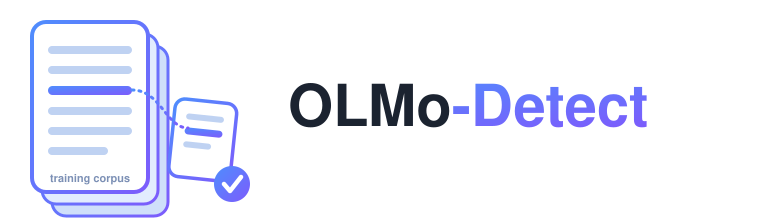

<p align="center">
  
</p>

<p align="center">
  <em>A Multi-Stage, Confounder-Controlled Benchmark for Membership Inference on Large Language Models</em>
</p>

<p align="center">
   
   
   
  <a href="LICENSE"></a>
</p>

---

This repository contains the data and code for the ICLR 2027 submission *OLMo-Detect: A Multi-Stage, Confounder-Controlled Benchmark for Membership Inference on Large Language Models.*


## Setup

```bash
curl -L https://anonymous.4open.science/api/repo/OLMo-Detect-A56F/zip -o OLMo-Detect.zip
unzip OLMo-Detect.zip -d OLMo-Detect && cd OLMo-Detect
python3 -m venv .venv
source .venv/bin/activate
pip install -r requirements.txt
```

Download the four OLMo 2 Instruct checkpoints and place under `olmo_models/`:

| Local directory | Hugging Face model |
|-----------------|--------------------|
| `olmo_models/OLMo2-1B-Instruct`  | [allenai/OLMo-2-0425-1B-Instruct](https://huggingface.co/allenai/OLMo-2-0425-1B-Instruct) |
| `olmo_models/OLMo2-7B-Instruct`  | [allenai/OLMo-2-1124-7B-Instruct](https://huggingface.co/allenai/OLMo-2-1124-7B-Instruct) |
| `olmo_models/OLMo2-13B-Instruct` | [allenai/OLMo-2-1124-13B-Instruct](https://huggingface.co/allenai/OLMo-2-1124-13B-Instruct) |
| `olmo_models/OLMo2-32B-Instruct` | [allenai/OLMo-2-0325-32B-Instruct](https://huggingface.co/allenai/OLMo-2-0325-32B-Instruct) |

```bash
hf download allenai/OLMo-2-0425-1B-Instruct  --local-dir olmo_models/OLMo2-1B-Instruct
hf download allenai/OLMo-2-1124-7B-Instruct  --local-dir olmo_models/OLMo2-7B-Instruct
hf download allenai/OLMo-2-1124-13B-Instruct --local-dir olmo_models/OLMo2-13B-Instruct
hf download allenai/OLMo-2-0325-32B-Instruct --local-dir olmo_models/OLMo2-32B-Instruct
```


## Benchmark

### Overview
Built upon the OLMo 2 training pipeline, OLMo-Detect comprises nine domains spanning all three stages of modern LLM training, shown as follows:

| Stage | Domain | Subsets | Benchmark directory |
|-------|--------|---------|---------------------|
| Pre-training | DCLM-Baseline |  | `pretraining/dclm/` |
| Pre-training | peS2o |  | `pretraining/pes2o/` |
| Pre-training | OpenWebMath |  | `pretraining/openwebmath/` |
| Pre-training | StarCoder | Python, Java | `pretraining/starcoder/` |
| Mid-training | Math Mix | GSM8K | `midtraining/gsm8k/` |
| Mid-training | Stack Exchange | Stack Overflow, Math Stack Exchange | `midtraining/stackexchange/` |
| Post-training | SFT | WildChat, Aya | `posttraining/sft/` |
| Post-training | DPO | UF-WildChat | `posttraining/dpo/` |
| Post-training | RLVR | CoT-GSM8K, CoT-MATH | `posttraining/rlvr/` |

- blanks indicate single-subset domains whose subset shares the domain’s name.

The repository is organized as follows:

```
OLMo-Detect/
├── benchmark/                         # benchmark data — 9 domains × 3 stages
│   └── <stage>/<domain>/
│       ├── member/
│       │   ├── matched/<split>/       # member_<stage>_<domain>_matched_<split>.jsonl
│       │   └── shifted/<split>/       # member_<stage>_<domain>_shifted_<split>.jsonl
│       └── non-member/<split>/        # non-member_<stage>_<domain>_<split>.jsonl
├── results/                           # per-record scores (every method × model size)
├── results_lodo/                      # leave-one-domain-out scores for supervised MIAs
├── methods/                           # MIA implementations 
├── analysis/                          # results → the paper's tables and statistics
├── construction/                      # how the benchmark was built (13-gram filtering, sampling)
├── run_all.py                         # Step 1: run a method across all domains
├── evaluate.py                        # Step 2: AUC / TPR@5%FPR (all-stage / per-stage / per-domain / per-subset)
├── run_detection.py                   # score one (model, file, method); called by run_all
├── run_emmia_fleet.py                 # EMMIA requires a different scorer than the rest of the MIAs
├── detector.py, model_utils.py, data_utils.py, base_method.py, method_loader.py   # core engine
├── config.py                          # all paths; override with environment variables
├── requirements.txt
└── .gitignore
```

- `<split>`: `dev` (hyperparameter tuning) or `test` (evaluation).
- `matched`: `OLMo-Detect`, where member and non-member splits are explicitly aligned along up to three axes: text quality, temporal range, and lexical similarity.
- `shifted`: `OLMo-Detect (Shifted)`, where member splits are sampled without distributional alignment to their non-member counterparts.
- Non-members are **shared** between `matched` and `shifted` setting, which is why they have no `matched/`/`shifted/` level.
- **DPO** additionally has separate `chosen`, `rejected` and `pair` files (e.g. `..._chosen_matched_test.jsonl`), since its two scored inputs are evaluated independently; the `pair` file holds the preference pair itself (`chosen_text` + `rejected_text`) for methods that score a pair jointly.
- Math Mix and RLVR have no shifted variant.


### Data Format
Every instance has a **`text`** field, which is the input scored by MIAs (for DPO `pair` files, the scored inputs are `chosen_text` and `rejected_text` instead). Non-members carry per-model **`<size>_13-gram_overlap_score`** fields (the 13-gram overlap with the OLMo 2 corpus). Additionally, each domain keeps its source-native metadata:

| Domain | Domain-specific fields |
|--------|------------------------|
| **DCLM-Baseline** | `url`, `metadata` (WARC headers), `warcinfo`, `language_id_whole_page_fasttext`, `fasttext_openhermes_reddit_eli5_vs_rw_v2_bigram_200k_train_prob` (the quality score OLMo 2 thresholds on), `bff_contained_ngram_count_before_dedupe`, `previous_word_count` |
| **peS2o** | `id`, `added`, `created` |
| **OpenWebMath** | `url`, `created`, `metadata` (math-extraction info) |
| **StarCoder** | `id`, `max_stars_repo_path`, `max_stars_repo_name`, `max_stars_count`, `top1_word_freq`, `top2_word_freq` |
| **Math Mix** | `id`, `source`, `added`, `created`, `metadata` (original question/answer) |
| **Stack Exchange** | `created`, `question_score`, `answer_score` |
| **SFT** | `messages` (chat turns; `text` is the rendered chat-templated string) |
| **DPO** | `chosen`, `rejected`, `chosen_model`, `rejected_model`; `pair` files add `prompt`, `chosen_text` and `rejected_text` |
| **RLVR** | `messages`, `ground_truth`, `dataset`, `constraint_type`, `constraint`, `text_no_cot` |


### Source Data

The source files used to sample each domain are detailed below:

| Domain | Non-member | Member |
|--------|------------|--------|
| **DCLM-Baseline** | Remainder of DCLM-RefinedWeb: [global-shard_01-local-shard_0, global-shard_05-local-shard_6, global-shard_07-local-shard_3](https://data.commoncrawl.org/contrib/datacomp/DCLM-refinedweb/index.html) | olmo-mix-1124 DCLM-Baseline [global-shard_01-local-shard_0](https://huggingface.co/datasets/allenai/olmo-mix-1124/tree/main/data/dclm/raw/hero-run-fasttext_for_HF/filtered/OH_eli5_vs_rw_v2_bigram_200k_train/fasttext_openhermes_reddit_eli5_vs_rw_v2_bigram_200k_train/processed_data/global-shard_01_of_10/local-shard_0_of_10), [global-shard_05-local-shard_6](https://huggingface.co/datasets/allenai/olmo-mix-1124/tree/main/data/dclm/raw/hero-run-fasttext_for_HF/filtered/OH_eli5_vs_rw_v2_bigram_200k_train/fasttext_openhermes_reddit_eli5_vs_rw_v2_bigram_200k_train/processed_data/global-shard_05_of_10/local-shard_6_of_10), [global-shard_07-local-shard_3](https://huggingface.co/datasets/allenai/olmo-mix-1124/tree/main/data/dclm/raw/hero-run-fasttext_for_HF/filtered/OH_eli5_vs_rw_v2_bigram_200k_train/fasttext_openhermes_reddit_eli5_vs_rw_v2_bigram_200k_train/processed_data/global-shard_07_of_10/local-shard_3_of_10) |
| **peS2o** | [validation-00.jsonl](https://huggingface.co/datasets/allenai/peS2o/blob/main/data/v2/validation-00000-of-00002.json.gz), [validation-01.jsonl](https://huggingface.co/datasets/allenai/peS2o/blob/main/data/v2/validation-00001-of-00002.json.gz) | [olmo-mix-1124 peS2o](https://huggingface.co/datasets/allenai/olmo-mix-1124/tree/main/data/pes2o) |
| **OpenWebMath** | Held-out [test.jsonl.zst and val.jsonl.zst](https://huggingface.co/datasets/EleutherAI/proof-pile-2/tree/main/open-web-math) | [olmo-mix-1124 OpenWebMath](https://huggingface.co/datasets/allenai/olmo-mix-1124/tree/main/data/open-web-math/train) |
| **StarCoder** | Rejected remainder of original StarCoder [Python](https://huggingface.co/datasets/bigcode/starcoderdata/tree/main/python) (`train-00000-of-00059` … `train-00058-of-00059`) and [Java](https://huggingface.co/datasets/bigcode/starcoderdata/tree/main/java) (`train-00000-of-00087` … `train-00086-of-00087`) | [olmo-mix-1124 Python and Java](https://huggingface.co/datasets/allenai/olmo-mix-1124/tree/main/data/starcoder/v1-decon-100_to_20k-2star-top_token_030/documents) |
| **Math Mix** (GSM8K) | Held-out [gsm8k test-00000-of-00001.parquet](https://huggingface.co/datasets/openai/gsm8k/blob/main/main/test-00000-of-00001.parquet), excluding the 200 instances OLMo 2 designates as its evaluation dev set | [dolmino-mix-1124 GSM8K](https://huggingface.co/datasets/allenai/dolmino-mix-1124/tree/main/data/math/gsm8k/main/train) |
| **Stack Exchange** | Rejected remainder of the [original 2024-09-30 Stack Exchange dump](https://archive.org/details/stackexchange_20240930), processed through OLMo 2's pipeline to obtain matched Q&A format | [dolmino-mix-1124 Stack Exchange](https://huggingface.co/datasets/allenai/dolmino-mix-1124/tree/main/data/stackexchange) |
| **SFT** | Unused portions of original [WildChat](https://huggingface.co/datasets/allenai/WildChat-1M/tree/main/data) (`train-00000-of-00014` … `train-00013-of-00014`) and [Aya](https://huggingface.co/datasets/CohereLabs/aya_dataset/tree/main/data) (`test-00000-of-00001`, `train-00000-of-00001`) | [tulu-3-sft-olmo-2-mixture WildChat and Aya](https://huggingface.co/datasets/allenai/tulu-3-sft-olmo-2-mixture/tree/main/data) (7B, 13B)<br>[tulu-3-sft-olmo-2-mixture-0225 WildChat and Aya](https://huggingface.co/datasets/allenai/tulu-3-sft-olmo-2-mixture-0225/tree/main/data) (1B, 32B) |
| **DPO** (UF-WildChat) | Remainder of original [WildChat](https://huggingface.co/datasets/allenai/WildChat-1M/tree/main/data) (`train-00000-of-00014` … `train-00013-of-00014`) as the prompt pool, then OLMo 2's [UltraFeedback pipeline](https://github.com/allenai/open-instruct/blob/main/scripts/synth_pref/README.md) for response generation and preference annotation | WildChat (Unused) subset of [olmo-2-0425-1b](https://huggingface.co/datasets/allenai/olmo-2-0425-1b-preference-mix) (1B), [olmo-2-1124-7b](https://huggingface.co/datasets/allenai/olmo-2-1124-7b-preference-mix) (7B), [olmo-2-1124-13b](https://huggingface.co/datasets/allenai/olmo-2-1124-13b-preference-mix) (13B), [olmo-2-0325-32b](https://huggingface.co/datasets/allenai/olmo-2-0325-32b-preference-mix) (32B) preference mixes |
| **RLVR** (CoT-GSM8K, CoT-MATH) | Built by prepending the same CoT exemplars OLMo 2's RLVR setup uses (8-shot for GSM8K, 3-shot for MATH) to [gsm8k test-00000-of-00001.parquet](https://huggingface.co/datasets/openai/gsm8k/blob/main/main/test-00000-of-00001.parquet) and to the **test split** of [MATH's train-00000-of-00001-7320a6f3aba8ebd2.parquet](https://huggingface.co/datasets/qwedsacf/competition_math/tree/main/data) (that file mixes train and test; separate them first) | [RLVR-GSM-MATH-IF-Mixed-Constraints](https://huggingface.co/datasets/allenai/RLVR-GSM-MATH-IF-Mixed-Constraints/tree/main/data) |


## Infini-Gram Indexed OLMo 2 Corpus
The original OLMo 2 data is available from the following sources:

- **Pre-training:** [olmo-mix-1124](https://huggingface.co/datasets/allenai/olmo-mix-1124)
- **Mid-training:** [dolmino-mix-1124](https://huggingface.co/datasets/allenai/dolmino-mix-1124)
- **Post-training:**
  - **SFT:**
    - 7B and 13B: [tulu-3-sft-olmo-2-mixture](https://huggingface.co/datasets/allenai/tulu-3-sft-olmo-2-mixture)
    - 1B and 32B: [tulu-3-sft-olmo-2-mixture-0225](https://huggingface.co/datasets/allenai/tulu-3-sft-olmo-2-mixture-0225)
  - **DPO:**
    - 1B: [olmo-2-0425-1b-preference-mix](https://huggingface.co/datasets/allenai/olmo-2-0425-1b-preference-mix)
    - 7B: [olmo-2-1124-7b-preference-mix](https://huggingface.co/datasets/allenai/olmo-2-1124-7b-preference-mix)
    - 13B: [olmo-2-1124-13b-preference-mix](https://huggingface.co/datasets/allenai/olmo-2-1124-13b-preference-mix)
    - 32B: [olmo-2-0325-32b-preference-mix](https://huggingface.co/datasets/allenai/olmo-2-0325-32b-preference-mix)
  - **RLVR:** [RLVR-GSM-MATH-IF-Mixed-Constraints](https://huggingface.co/datasets/allenai/RLVR-GSM-MATH-IF-Mixed-Constraints)

We employ Infini-gram, a suffix-array–based indexing system, to index the full OLMo 2 training corpus across all four model sizes and all three training stages. The complete indexed corpus (~12.3 TB) is available for download (link withheld for anonymity and will be released after the anonymity period).


## Benchmark Construction Code
The `construction/` directory contains the code that built the benchmark:

- `13gram_filtering.py`: filters non-member instances against the infini-gram–indexed OLMo 2 corpus, keeping only those whose 13-gram overlap stays below the 20% threshold. For DCLM-Baseline, StarCoder, and Stack Exchange, it also applies a text quality boundary check. The DCLM quality filter needs the fastText model from [mlfoundations/fasttext-oh-eli5](https://huggingface.co/mlfoundations/fasttext-oh-eli5).
- `sample_member_candidates.py`: samples the member candidate pool via boundary sampling for quality-filtered domains (DCLM-Baseline, StarCoder, and Stack Exchange), retaining instances whose text quality scores sit just above OLMo 2's filtering threshold.
- `simulated_annealing_sampling.py`: selects the final member split from the candidate pool via constrained simulated annealing, matching the non-member split's instance count and token count while minimizing lexical (Jensen–Shannon divergence, computed in base-2 / bits so it lies in [0, 1]) and, where dates are available, temporal distribution mismatch.


## Reproducing Results

**Step 1: Get Per-Record Scores.**

Run the target method across all domains. This step is optional: `results/` already holds the per-record scores for every method and model size.
```bash
python run_all.py --method <method> --split matched --out results_repro   # OLMo-Detect
```
- `--split`: `matched` (OLMo-Detect) or `shifted` (OLMo-Detect (Shifted)).
- `<method>`: `loss_zlib_lowercase` (PPL, Zlib, Lower), `minkprob` (MinK, MinK++), `dcpdd` (DCPDD), `recall` (ReCaLL), `camia_faithful` (CAMIA), `pac` (PAC), `neighborhood_attack` (Neigh.), `dcq` (DCQ), `guided_instruction` (Guided), `cdd` (CDD), `selfcrit` (SelfCrit), and the supervised `camia_lr` (Sup-CAMIA), `mia_tuner` (MIA-Tuner), `fsd` (FSD). EMMIA runs through `run_emmia_fleet.py`. SelfCrit is evaluated only on DPO and RLVR, following its original setup. `dcq` and `guided_instruction` call the OpenAI API and need `OPENAI_API_KEY`. Methods with tunable hyperparameters are tuned on the `dev` split.
- `--out`: output directory.

**Step 2: Compute AUC and TPR@5%FPR.**

Run `evaluate.py` for the target method:
```bash
python evaluate.py --list                                                               # show available method keys
python evaluate.py --method ppl --show-tpr --split matched                              # released scores in results/
python evaluate.py --method ppl --show-tpr --split matched --results-dir results_repro  # scores from Step 1
```

**FSD** fine-tunes the target model on the domain's non-member `dev` split, then computes the deviation for each base MIA as its score before fine-tuning minus its score after fine-tuning. Keys are `fsd_ppl`, `fsd_zlib`, `fsd_lower`, `fsd_mink` for the deviation and `base_ppl`, `base_zlib`, `base_lower`, `base_mink` for the score before fine-tuning:
```bash
python evaluate.py --method fsd_ppl  --show-tpr --results-dir results_repro
python evaluate.py --method base_ppl --show-tpr --results-dir results_repro
```

**Example.**

To evaluate PPL end to end:
```bash
python run_all.py --method loss_zlib_lowercase --split matched --out results_repro   # scores -> results_repro/
python evaluate.py --method ppl       --show-tpr --results-dir results_repro         # PPL
```


## Generalization Beyond OLMo 2

Evaluated with the five best-performing calibration-free MIAs: PPL, Zlib, MinK, DCPDD, and PAC. The supervised MIAs are excluded because they need a per-model dev set to train on.

Each external model is scored on the domain it actually trained on:

| Model directory | Hugging Face model | Domain |
|-----------------|--------------------|--------|
| `olmo_models/Olmo-3-7B-Instruct`    | [allenai/Olmo-3-7B-Instruct](https://huggingface.co/allenai/Olmo-3-7B-Instruct)       | GSM8K |
| `olmo_models/Olmo-3.1-32B-Instruct` | [allenai/Olmo-3.1-32B-Instruct](https://huggingface.co/allenai/Olmo-3.1-32B-Instruct) | GSM8K |
| `olmo_models/DCLM-1B`               | [TRI-ML/DCLM-1B](https://huggingface.co/TRI-ML/DCLM-1B)                               | DCLM, OpenWebMath |
| `olmo_models/DCLM-Baseline-7B`      | [apple/DCLM-Baseline-7B](https://huggingface.co/apple/DCLM-Baseline-7B)               | OpenWebMath |
| `olmo_models/SmolLM2-1.7B`          | [HuggingFaceTB/SmolLM2-1.7B](https://huggingface.co/HuggingFaceTB/SmolLM2-1.7B)       | DCLM |

```bash
hf download HuggingFaceTB/SmolLM2-1.7B --local-dir olmo_models/SmolLM2-1.7B
```

**Step 1: Build the DCPDD reference.**

DCPDD needs a C4 token-frequency reference per tokenizer, and only OLMo 2's is included. Skip this only for models sharing OLMo 2's tokenizer; otherwise DCPDD silently falls back to the OLMo 2 reference, which is wrong.
```bash
hf download allenai/c4 --repo-type dataset --local-dir data/c4_raw \
    --include 'en/c4-train.0000[0-2]-of-01024.json.gz'          # 3 shards cover the default 1,068,952 documents
python build_dcpdd_refs.py --models <model_dir> --c4-glob '<c4_shards>' --out-dir methods/dcpdd_data
```
- `<model_dir>`: model directory from the table above.
- `<c4_shards>`: glob over the C4 `en` shards (`*.json.gz`).
- writes `methods/dcpdd_data/c4_token_occurrence_<model>.json`.

**Step 2: Score the model on its domain.**

```bash
python run_detection.py --model <model_dir> --data <member_test> <non-member_test> \
    --method loss_zlib_lowercase minkprob dcpdd pac \
    --output-dir results_repro
```
- `--data`: the member and non-member **test** files of that domain; members come from the `matched` split.
- `--method`: four modules produce the five scores (`loss_zlib_lowercase` gives PPL and Zlib).

**Example.**

SmolLM2-1.7B on DCLM, end to end:
```bash
hf download HuggingFaceTB/SmolLM2-1.7B --local-dir olmo_models/SmolLM2-1.7B
hf download allenai/c4 --repo-type dataset --local-dir data/c4_raw \
    --include 'en/c4-train.0000[0-2]-of-01024.json.gz'

python build_dcpdd_refs.py --models olmo_models/SmolLM2-1.7B \
    --c4-glob 'data/c4_raw/en/*.json.gz' --out-dir methods/dcpdd_data

python run_detection.py --model olmo_models/SmolLM2-1.7B \
    --data benchmark/pretraining/dclm/member/matched/test/member_pretraining_dclm_matched_test.jsonl \
           benchmark/pretraining/dclm/non-member/test/non-member_pretraining_dclm_test.jsonl \
    --method loss_zlib_lowercase minkprob dcpdd pac \
    --output-dir results_repro
```


### Excluded non-members for SmolLM2

SmolLM2 trains on FineWeb-Edu as well as DCLM-Baseline, so our DCLM non-members had to be checked against FineWeb-Edu too (13-gram scan, all 110 dumps / 2,410 files / 1.53e9 documents). **8 of the 134 DCLM test non-members exceed the 0.20 overlap threshold and are excluded** (overlaps 0.855 down to 0.616); the remaining 126 reach at most 0.128, so the cut is unambiguous. One of the 16 development non-members also exceeds it, but the five MIAs used here need no dev split. The SmolLM2 row is computed paired on those 126, i.e. OLMo 2-1B is re-scored on the same 126 rather than on all 134.

The excluded record indices are in `analysis/logs/smollm2_excluded_nonmembers.json`:

```
[10, 11, 18, 25, 66, 106, 112, 118]
```

This applies only to the SmolLM2 comparison. Every other row uses the full non-member set.


## Additional Experiments

Each appendix experiment and the script that produces it.

| Experiment | Script |
|------------|--------|
| Per-domain AUC and TPR@5%FPR tables | `analysis/paper_tables.py appendix_domains [--metric tpr]` |
| Matched vs shifted, per domain, with significance | `analysis/shift_bootstrap.py` then `analysis/shift_table_paper.py`; `analysis/shift_sig_counts.py` |
| Domain-unknown evaluation (pooled vs per-domain, 100 members + 100 non-members per domain over 20 draws) | `analysis/subsample_pooled.py` and `analysis/lodo_threshold_check.py`, then `analysis/three_settings_table.py` |
| Effect of the labeled-data budget on supervised MIAs (10–50% of each domain, 5 seeds) | `analysis/lc_supcamia_full.py` |
| Cross-stage contrast | `analysis/cross_stage_matrix.py` then `analysis/cross_stage_table.py` |
| Bootstrap confidence intervals | `analysis/bootstrap_ci.py` then `analysis/bootstrap_ci_tables.py` |
| Model-size comparison, paired bootstrap | `analysis/size_pair_boot.py` |
| Cost of reusing matched hyperparameters on the shifted split | `analysis/shifted_tuning_penalty.py`, `analysis/shifted_retune.py` |
| Non-member verification against an external corpus (the FineWeb-Edu scan above) | `analysis/ngram_scan.py` |
| Score-file consistency audit | `analysis/audit_score_consistency.py` |

Scripts that consume another's output read it from `analysis/logs/`, so run the producer first where the table above lists two.

`lc_supcamia_full.py` needs the Sup-CAMIA leave-one-domain-out signal caches, which are not included because they are large pickles; you can regenerate them with `camia_lr_xdomain.py`. `ngram_scan.py` needs `pyahocorasick`.

## Evaluating a New Method

OLMo-Detect is meant as an evaluation suite, so you can plug in your own MIA and measure it with the same protocol.

**1. Implement the method.** Add `methods/<your_method>_method.py` with a subclass of `BaseMethod` (see `base_method.py`). It needs a `name` and a `run(model_bundle, dataset)` that returns a `samples` list: one score per record, where a **higher score means more likely a member**:
```python
# methods/mymethod_method.py
from base_method import BaseMethod

class MyMethod(BaseMethod):
    name = "mymethod"

    def run(self, model_bundle, dataset):
        samples = []
        for i, rec in enumerate(dataset.records):
            text = rec["text"]                          # the instance to score
            score = my_score(text, model_bundle)        # higher = more likely a member
            samples.append({"record_index": i, "score": float(score)})
        return {"samples": samples, "num_scored_records": len(samples)}
```
`model_bundle` exposes the loaded model/tokenizer (and `llm_adapter` scoring helpers); `dataset.records` are the raw instances. The existing files under `methods/` are good templates: `loss_zlib_lowercase_method.py` / `minkprob_method.py` for likelihood-based scoring, `cdd_method.py` / `selfcrit_method.py` for generation-based. The loader finds `methods/<name>_method.py` automatically, so `--method <name>` works with no further registration (to add a short alias, edit `method_loader.py`).

**2. Run it across all domains** (scores → `results_repro/`):
```bash
python run_all.py --method mymethod --split matched --out results_repro
```
`run_all` works with any method name. If your method needs the `dev` split as a reference, or long generations, add it to `DEV_METHODS` / `GEN_METHODS` in `run_all.py`.

**3. Score it.** Register the score column by adding one line to the `METHODS` map in `evaluate.py`: `"mymethod": ("mymethod", "score")` (file stem, score field), and then:
```bash
python evaluate.py --method mymethod --show-tpr --results-dir results_repro
```
